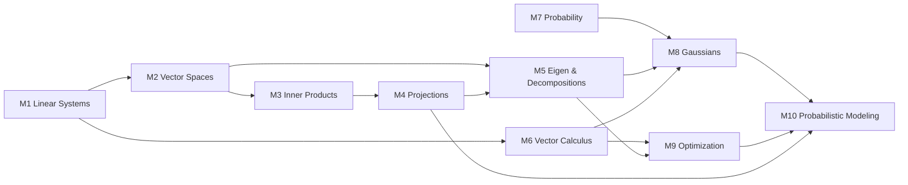
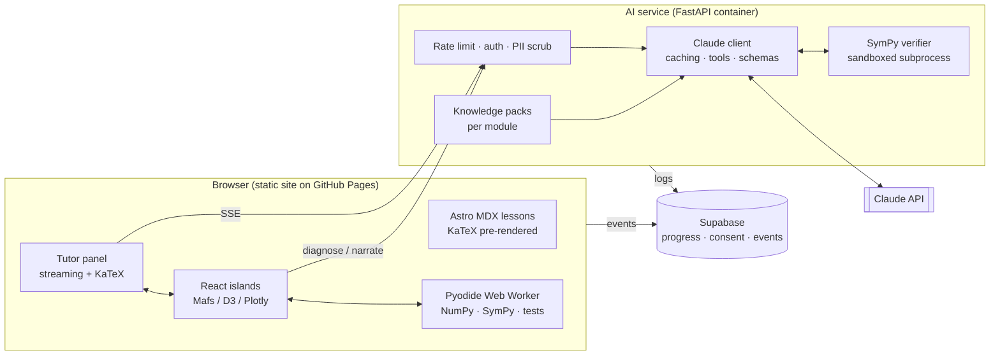
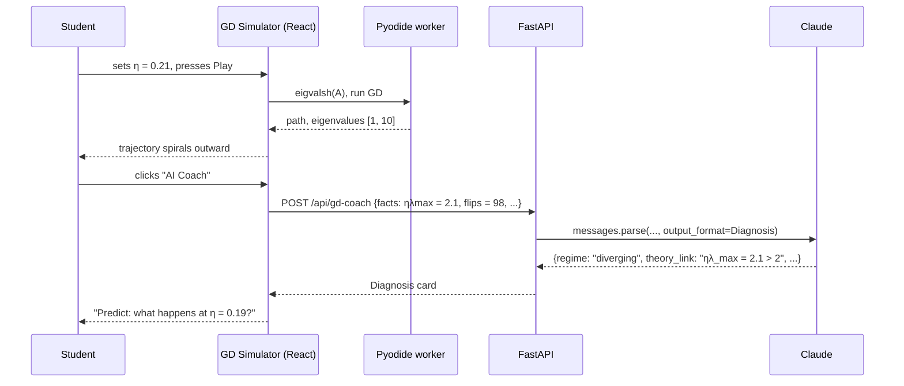

# MathMatrix AI — Research & Development Plan

> An AI-assisted, interactive curriculum for the mathematics behind data science: linear algebra, analytic geometry, matrix decompositions, vector calculus, probability, continuous optimization, and probabilistic modeling.

| | |
|---|---|
| **Project** | MathMatrix AI |
| **Role of this document** | Research framework, curriculum, AI feature specs, and reference architecture |
| **Audience** | Course designers, ML/LLM engineers, learning-science researchers, contributors |
| **Status** | v0.1 draft, 2026-10-05 |

---

## Contents

1. [Core Research Framework](#1-core-research-framework)
2. [Course Modules & Mathematical Scope](#2-course-modules--mathematical-scope)
3. [Interactive AI Feature Specifications](#3-interactive-ai-feature-specifications)
4. [Tech Stack & Architecture](#4-implementation-tech-stack--architecture)
5. [Prototype Module: Module 9, Gradient Descent](#5-prototype-module-module-9-gradient-descent)
6. [Roadmap, Evaluation & Risks](#6-roadmap-evaluation--risks)

---

## 1. Core Research Framework

### 1.1 Problem statement

Most data-science learners can *run* `PCA().fit(X)` or `loss.backward()` well before they can say what those calls compute. The math is taught as symbol manipulation (prove, derive, compute by hand), and the ML is taught as API calls. Little connects the two. MathMatrix AI is built on one claim: **the gap is about representation, not difficulty.** Students rarely see one idea expressed at the same time as an equation, a picture, running code, and a model behavior.

### 1.2 Primary learning challenges (friction points)

| # | Friction point | What it looks like in students | Root cause |
|---|---|---|---|
| **F1** | **Symbol–geometry disconnect** | Can compute `A @ x` but cannot predict what `A` does to the unit square; sees eigenvectors as "the output of `np.linalg.eig`" | Matrices are taught as number grids instead of *transformations* |
| **F2** | **Shape & index blindness** | Gradient of $\mathbf{x}^\top A\mathbf{x}$ comes out as a row vector one time and a column vector the next; broadcasting bugs | Notation conventions (numerator vs. denominator layout) are seldom stated explicitly |
| **F3** | **Decomposition as ritual** | Can recite $A = U\Sigma V^\top$ but cannot say why truncated SVD is the *best* rank-$k$ approximation, or when to pick QR, Cholesky, or eigendecomposition | Decompositions are presented as algorithms, not as *changes of basis that expose structure* |
| **F4** | **Gradient opacity** | Treats backprop as magic; cannot debug vanishing or exploding gradients | The multivariate chain rule is never made visible on a computational graph |
| **F5** | **Conditional-probability inversion** | Mixes up $p(A\mid B)$ and $p(B\mid A)$; ignores base rates; misreads posteriors | Bayes is taught as a formula, without natural-frequency or area intuition |
| **F6** | **Distribution abstraction gap** | Cannot link $\Sigma$ to the shape of a point cloud; change of variables (Jacobian determinant) feels arbitrary | Multivariate Gaussians are shown as density formulas, not as transformed spheres |
| **F7** | **Optimization as black box** | Picks learning rates at random; does not link divergence to curvature or condition number | Convergence theory and hands-on hyperparameter tuning are taught in separate courses |
| **F8** | **Modeling-assumption invisibility** | Does not see that least squares = Gaussian-noise MLE, or ridge = Gaussian-prior MAP | Probabilistic and optimization views of one model are never put side by side |
| **F9** | **Feedback latency** | A wrong derivation gets noticed days later in a graded problem set, or never | Instructors cannot give step-level feedback at scale |

### 1.3 Theoretical grounding

The platform design draws on established learning-science findings:

- **Multiple external representations** (Ainsworth's DeFT framework): learners gain the most when representations are *linked*. A change in one (dragging a matrix entry) immediately updates the others (the equation, the plot, the code output). This targets F1, F3, and F6.
- **Cognitive load theory** (Sweller): worked examples and faded scaffolding reduce extraneous load for novices. This shapes the step-by-step breakdown engine.
- **Self-explanation effect** (Chi et al.): prompting learners to explain steps in their own words improves transfer. The AI tutor asks for explanations before it gives them.
- **Productive failure** (Kapur): letting students attempt a problem before instruction, such as tuning a learning rate by hand, improves conceptual understanding. This shapes the simulator-first module openings.
- **Bloom's 2-sigma problem**: one-on-one tutoring sharply outperforms classroom instruction. LLM tutors are a scalable approximation *only if* their mathematical correctness is controlled, which is why every AI feature here includes a verification layer.

### 1.4 How AI-assisted interactivity resolves each friction point

| Friction | Intervention | AI's specific role |
|---|---|---|
| F1, F3 | **Linked-representation visualizers**: drag a matrix entry, then watch the grid deform, eigenvectors stay on their span, and SVD factor into rotate → scale → rotate | LLM narrates *what changed and why* in the current state ("you made $a_{12}=a_{21}$, so the matrix is symmetric, and its eigenvectors just became orthogonal") |
| F2 | **Shape-aware derivation stepper**: every expression is annotated with its shape, e.g. $\underbrace{A}_{m\times n}\underbrace{\mathbf{x}}_{n\times 1}$ | LLM generates the derivation; a CAS (SymPy) checks each step; the UI flags shape mismatches |
| F4 | **Computational-graph backprop stepper** | AI tutor asks the student to predict the next local gradient before revealing it |
| F5 | **Natural-frequency Bayes grids** (1000 icons) next to the formula | "Muddiest Point" clarifier detects inversion errors in free-text answers |
| F6 | **Draggable covariance ellipses and transform-a-Gaussian sandbox** | AI explains the Jacobian term as "how much the map stretches local area" for the student's own map |
| F7 | **Gradient-descent flight simulator** | AI coach diagnoses the trajectory (oscillation, divergence, plateau) and links it to $\eta\lambda_{\max}$ |
| F8 | **Dual-view model cards**: optimization view and probabilistic view of the same model, side by side | AI turns the student's chosen prior or noise model into the equivalent regularizer |
| F9 | **Instant-feedback notebooks**: in-browser Python, hidden tests, hint ladder | LLM produces graduated hints grounded in the failing test, never the full solution on the first request |

### 1.5 Research questions

- **RQ1 (Conceptual transfer):** Do linked interactive representations with AI narration produce larger gains on conceptual inventories than static text plus the same exercises?
- **RQ2 (Tutor design):** Does a Socratic, hint-first LLM tutor beat an answer-first LLM tutor on delayed post-tests, at the cost of more time on task?
- **RQ3 (Verification):** Does CAS-backed verification of LLM math reduce error rates the student sees to an acceptable level (target < 1% of math claims), and does visible "verified ✓" labelling change trust and learning?
- **RQ4 (Bridging):** Do explicit "math → ML bridge" labs (e.g., implementing PCA from SVD) improve students' ability to debug real ML code?

### 1.6 Study design

- **Design:** A/B randomized at the student level within cohorts, with features toggled by flag (§4). A crossover design is used where modules are independent.
- **Instruments:**
  - Pre/post **concept inventory** per module: 8–12 items, written with misconception-based distractors, and validated with item-response analysis after pilot.
  - **Delayed post-test** at 3–4 weeks.
  - **Transfer task:** debug a broken ML notebook (wrong gradient sign, rank-deficient design matrix, misspecified covariance).
  - **Process data:** time on task, hint-ladder depth, simulator parameters explored, tutor-dialogue turns (xAPI events).
- **Analysis:** Mixed-effects models (student and module random effects); normalized learning gain $g = \frac{\text{post}-\text{pre}}{100-\text{pre}}$.
- **Ethics:** IRB approval before collecting identifiable data; opt-in consent for dialogue logging; PII stripped before any LLM call; a clearly marked "AI may be wrong" disclosure, with a path to report errors.

---

## 2. Course Modules & Mathematical Scope

Every module follows the same **five-part lesson loop**:

1. **Hook / productive failure:** an interactive task attempted *before* instruction.
2. **Concept:** short text plus LaTeX, linked to a live visual.
3. **Derivation stepper:** a key result derived step by step, with AI-checked student explanations.
4. **Code lab:** implement from scratch in NumPy (in-browser via Pyodide), then compare to the library.
5. **ML bridge:** the same idea inside a real model, followed by a misconception quiz.

---

### Module 1 — Systems of Linear Equations & Matrix Operations

| | |
|---|---|
| **Core math** | $A\mathbf{x}=\mathbf{b}$; Gaussian elimination; row-echelon / reduced row-echelon form; general solution $=$ particular $+$ homogeneous solutions; matrix product as composition; inverse and transpose rules $(AB)^{-1}=B^{-1}A^{-1}$, $(AB)^\top = B^\top A^\top$ |
| **Key misconceptions** | $AB = BA$; $(A+B)^{-1} = A^{-1}+B^{-1}$; "no unique solution" means "no solution" |
| **Interactive visual** | **Plane-intersection explorer**: 3 equations shown as 3 planes; row operations animate while the solution set stays fixed (point / line / plane / empty) |
| **Code lab** | Implement Gaussian elimination with partial pivoting; compare to `np.linalg.solve`; show how tiny pivots blow up error (preview of conditioning) |
| **ML bridge** | Linear regression normal equations $X^\top X\boldsymbol\theta = X^\top \mathbf{y}$ as a linear system |
| **AI touchpoint** | Row-reduction checker: the student enters each row operation; the AI flags the first invalid step and explains *why* it changes the solution set |

### Module 2 — Vector Spaces, Basis, Rank & Linear Mappings

| | |
|---|---|
| **Core math** | Vector spaces and subspaces; span; linear independence; basis and dimension; rank; kernel and image; **rank–nullity** $\dim\ker\Phi + \operatorname{rk}\Phi = n$; transformation matrices; change of basis $\tilde A = T^{-1} A S$ |
| **Key misconceptions** | A basis is unique; rank counts nonzero entries; any $n$ vectors span $\mathbb{R}^n$ |
| **Interactive visual** | **Span explorer**: drag 2–3 vectors and watch their span go from line to plane to space. **Kernel collapse**: animate a rank-deficient map squashing $\mathbb{R}^3$ onto a plane, with the kernel highlighted |
| **Code lab** | Compute rank by elimination vs. `np.linalg.matrix_rank` (tolerance-based); find a kernel basis |
| **ML bridge** | Multicollinearity: duplicated or linearly dependent features make $X^\top X$ singular; one-hot "dummy variable trap" |
| **AI touchpoint** | "Is it a basis?" challenge: the student proposes a set, and the AI asks probing questions (Do they span? Are they independent? How do you know?) |

### Module 3 — Norms, Inner Products & Orthogonality

| | |
|---|---|
| **Core math** | Norms $\lVert\cdot\rVert_1, \lVert\cdot\rVert_2, \lVert\cdot\rVert_\infty$; general inner product $\langle\mathbf{x},\mathbf{y}\rangle = \mathbf{x}^\top A\mathbf{y}$ with $A$ symmetric positive definite; induced norm and distance; Cauchy–Schwarz $\lvert\langle\mathbf{x},\mathbf{y}\rangle\rvert \le \lVert\mathbf{x}\rVert\lVert\mathbf{y}\rVert$; angles; orthogonal complement; orthogonal matrices $Q^\top Q = I$ |
| **Key misconceptions** | "Orthogonal" always means "dot product is zero" (depends on the inner product); every norm comes from an inner product |
| **Interactive visual** | **Unit-ball morpher**: slide $p$ from 1 to ∞ in $\lVert\cdot\rVert_p$. **Custom inner product**: edit $A$ and watch "orthogonal" pairs and the unit circle (an ellipse) change |
| **Code lab** | Cosine similarity for text embeddings; verify Cauchy–Schwarz numerically |
| **ML bridge** | L1 vs. L2 regularization: why the L1 ball's corners give sparse solutions (Lasso); cosine similarity in retrieval and embeddings; kernels as inner products |
| **AI touchpoint** | "Explain the corner": the student explains Lasso sparsity from the picture; AI grades against a rubric |

### Module 4 — Orthonormal Basis & Orthogonal Projections

| | |
|---|---|
| **Core math** | Orthonormal bases (ONB); Gram–Schmidt; projection onto a subspace $U=\operatorname{span}(B)$: $\pi_U(\mathbf{x}) = B(B^\top B)^{-1}B^\top\mathbf{x}$; projection matrix $P$ is idempotent ($P^2=P$) and symmetric; with an ONB, $P = BB^\top$; QR decomposition |
| **Key misconceptions** | Projection = scaling; the residual can have any direction |
| **Interactive visual** | **Shadow projector**: drag $\mathbf{x}$ and the subspace; the residual $\mathbf{x}-\pi_U(\mathbf{x})$ always stays at 90°. **Gram–Schmidt stepper** that subtracts projections one at a time |
| **Code lab** | Implement classical vs. modified Gram–Schmidt; measure orthogonality loss $\lVert Q^\top Q - I\rVert$ on ill-conditioned input |
| **ML bridge** | **Least squares *is* a projection**: $\hat{\mathbf{y}} = X(X^\top X)^{-1}X^\top\mathbf{y}$ (the "hat matrix"); solving via QR for numerical stability |
| **AI touchpoint** | Derivation stepper for the normal equations from the orthogonality condition $X^\top(\mathbf{y}-X\boldsymbol\theta)=\mathbf{0}$ |

### Module 5 — Determinants, Eigenvalues & Eigenvectors (+ Matrix Decompositions)

| | |
|---|---|
| **Core math** | Determinant as signed volume scale factor; $\det(AB)=\det A\det B$; characteristic polynomial $\det(A-\lambda I)=0$; eigenspaces; diagonalization $A = PDP^{-1}$; **spectral theorem** (symmetric $A = Q\Lambda Q^\top$); Cholesky $A = LL^\top$ for SPD; **SVD** $A = U\Sigma V^\top$; Eckart–Young: truncated SVD $A_k$ minimizes $\lVert A - B\rVert_2$ over rank-$k$ $B$ |
| **Key misconceptions** | Every matrix is diagonalizable; eigenvalues of $A+B$ are sums of eigenvalues; singular values = eigenvalues |
| **Interactive visual** | **Matrix Decomposition Lens** (Feature C, §3): a 2×2 or 3×3 transform shown as composed rotations and scalings; eigenvectors drawn as "directions that only stretch"; a determinant shown as the area of the deformed unit square |
| **Code lab** | Power iteration from scratch; image compression with truncated SVD (rank vs. reconstruction error curve); PCA from the SVD of centered data |
| **ML bridge** | PCA; PageRank (dominant eigenvector); covariance whitening via Cholesky; low-rank recommender systems |
| **AI touchpoint** | "Predict the eigenvectors": the student sketches guesses on the canvas, then the AI compares to truth and explains the gap |

### Module 6 — Partial Differentiation & Vector Gradients

| | |
|---|---|
| **Core math** | Partial derivatives; gradient $\nabla f$; Jacobian $J\in\mathbb{R}^{m\times n}$; multivariate chain rule $\frac{\partial f}{\partial \mathbf{x}} = \frac{\partial f}{\partial \mathbf{g}}\frac{\partial \mathbf{g}}{\partial \mathbf{x}}$; gradients w.r.t. matrices; identities $\nabla_{\mathbf{x}}(\mathbf{x}^\top A\mathbf{x}) = (A+A^\top)\mathbf{x}$ and $\nabla_{\mathbf{x}}\lVert A\mathbf{x}-\mathbf{b}\rVert^2 = 2A^\top(A\mathbf{x}-\mathbf{b})$; Hessian; Taylor expansion; backpropagation and automatic differentiation (reverse mode) |
| **Key misconceptions** | Gradient shape = shape of the output; chain rule multiplication order doesn't matter |
| **Interactive visual** | **Gradient field over contours**: the gradient is always ⟂ to level sets. **Backprop stepper** on a computational graph (forward values, then local gradients flowing backward) |
| **Code lab** | Finite-difference gradient checker; a ~60-line scalar reverse-mode autodiff (micrograd-style) |
| **ML bridge** | Backprop for a 2-layer MLP; vanishing gradients from repeated multiplication by small Jacobians |
| **AI touchpoint** | **Shape-annotated derivation stepper** with CAS verification of each step (§5.4) |

### Module 7 — Probability Spaces, Rules & Bayes' Theorem

| | |
|---|---|
| **Core math** | Sample space, events, probability measure (light-touch σ-algebra); sum rule $p(x)=\sum_y p(x,y)$; product rule $p(x,y)=p(y\mid x)p(x)$; **Bayes** $p(\theta\mid\mathbf{x}) = \frac{p(\mathbf{x}\mid\theta)\,p(\theta)}{p(\mathbf{x})}$; independence and conditional independence; expectation, variance, covariance; $\operatorname{Var}[X] = \mathbb{E}[X^2]-\mathbb{E}[X]^2$ |
| **Key misconceptions** | $p(A\mid B)=p(B\mid A)$; base-rate neglect; uncorrelated ⇒ independent |
| **Interactive visual** | **Natural-frequency grid** (1000 people, test sensitivity, specificity, prevalence sliders); **area-diagram Bayes**; joint-distribution heatmap with marginal histograms |
| **Code lab** | Monte Carlo verification of Bayes; Naive Bayes spam classifier from counts |
| **ML bridge** | Naive Bayes; classifier calibration; posterior as belief update |
| **AI touchpoint** | **Muddiest Point clarifier** (Feature A) tuned to detect conditional inversion in free-text explanations |

### Module 8 — Gaussian Distributions & Change of Variables

| | |
|---|---|
| **Core math** | Univariate and multivariate Gaussian $\mathcal{N}(\boldsymbol\mu,\Sigma)$; marginals and conditionals of Gaussians stay Gaussian; product of Gaussians; affine transform: $\mathbf{x}\sim\mathcal{N}(\boldsymbol\mu,\Sigma) \Rightarrow A\mathbf{x}+\mathbf{b}\sim\mathcal{N}(A\boldsymbol\mu+\mathbf{b}, A\Sigma A^\top)$; **change of variables** $p_Y(\mathbf{y}) = p_X(g^{-1}(\mathbf{y}))\,\lvert\det J_{g^{-1}}(\mathbf{y})\rvert$; sampling via $\mathbf{x} = \boldsymbol\mu + L\mathbf{z}$, $\Sigma = LL^\top$ |
| **Key misconceptions** | The covariance ellipse axes align with coordinate axes; you can transform a density by plugging in $g^{-1}$ and forgetting the Jacobian |
| **Interactive visual** | **Covariance ellipse sculptor**: drag the ellipse and $\Sigma$ updates live (and vice versa), with eigenvectors as ellipse axes (links to M5). **Conditional slicer**: slide a line $x_2 = c$ to see $p(x_1\mid x_2=c)$. **Density warp**: apply a nonlinear map and watch the histogram vs. the Jacobian-corrected density |
| **Code lab** | Sample correlated Gaussians via Cholesky; verify change-of-variables numerically with histograms |
| **ML bridge** | Gaussian processes (conditioning); VAE reparameterization trick; normalizing flows (log-det-Jacobian) |
| **AI touchpoint** | "Explain the Jacobian for *your* map": AI produces a personalized explanation for the student's chosen transform, checked by CAS |

### Module 9 — Continuous Optimization & Gradient Descent

| | |
|---|---|
| **Core math** | Gradient descent $\mathbf{x}_{k+1} = \mathbf{x}_k - \eta\nabla f(\mathbf{x}_k)$; step size and curvature; convergence on quadratics, $0<\eta<2/\lambda_{\max}$; condition number $\kappa$; momentum; stochastic GD; constrained optimization and Lagrange multipliers; convex sets and functions; Jensen; convex duality (light) |
| **Key misconceptions** | A larger learning rate is always faster; the gradient points to the minimum; non-convex ⇒ GD useless |
| **Interactive visual** | **Gradient Descent Flight Simulator** (Feature B; full prototype in §5) |
| **Code lab** | GD / momentum / SGD from scratch; empirical vs. theoretical convergence rate |
| **ML bridge** | Training loops; learning-rate schedules; why feature scaling (lower $\kappa$) speeds training |
| **AI touchpoint** | Trajectory diagnosis coach with structured output (§5.5) |

### Module 10 — Probabilistic Modeling, Parameter Estimation & Graphical Models

| | |
|---|---|
| **Core math** | Maximum likelihood $\boldsymbol\theta_{\text{ML}} = \arg\max_{\boldsymbol\theta} \sum_n \log p(\mathbf{y}_n\mid\mathbf{x}_n,\boldsymbol\theta)$; MAP $\boldsymbol\theta_{\text{MAP}} = \arg\max_{\boldsymbol\theta} \log p(\mathcal{D}\mid\boldsymbol\theta) + \log p(\boldsymbol\theta)$; **least squares = Gaussian-noise MLE**; **ridge = Gaussian-prior MAP** with $\lambda = \sigma^2/b^2$ for noise variance $\sigma^2$ and prior $\mathcal{N}(\mathbf{0}, b^2 I)$; Bayesian linear regression posterior; model selection (cross-validation, marginal likelihood, BIC); directed graphical models with factorization $p(\mathbf{x}) = \prod_k p(x_k\mid \mathrm{Pa}_k)$; conditional independence and d-separation; latent variables, GMMs, and EM |
| **Key misconceptions** | MLE always generalizes; priors are "cheating"; arrows in a Bayesian network mean causation |
| **Interactive visual** | **Dual-view model card**: change the noise model or prior and watch the loss function and regularizer change in sync. **Bayesian regression animator**: posterior over lines tightens as points are clicked in. **DAG builder** with d-separation checker |
| **Code lab** | Fit linear regression three ways (MLE, MAP, full Bayesian) and compare; EM for a 2-component GMM |
| **ML bridge** | Regularization as prior; uncertainty quantification; generative vs. discriminative models |
| **AI touchpoint** | **Capstone tutor**: student describes a dataset → AI helps build the graphical model and pick a likelihood, with the student justifying each choice |

### 2.1 Module dependency graph



---

## 3. Interactive AI Feature Specifications

Four principles apply to every feature:

1. **Ground, then generate.** The LLM always gets the current module's curated knowledge pack (definitions, notation conventions, known misconceptions) and the *live UI state*. It never answers from the bare question alone.
2. **Verify math claims.** Symbolic claims go through a SymPy verification tool; numeric claims are re-computed client-side in Pyodide. Verified statements show a ✓ badge.
3. **Hint before answer.** Default pedagogy is Socratic; full solutions unlock only after attempts, or when the student explicitly opts in.
4. **Notation contract.** One notation convention throughout (column vectors, numerator-layout Jacobians, $\boldsymbol\theta$ for parameters), enforced in the system prompt and the content linter.

---

### Feature A — "Muddiest Point" Clarifier (Socratic LLM tutor)

**Purpose:** At the end of each lesson section, the student writes what was most confusing. The clarifier diagnoses the misconception, asks one targeted question, then explains at the right level, linked to the visual. *(Targets F2, F4, F5, F8, F9.)*

**UI requirements**

- A slide-over panel, opened from a "😕 Still muddy?" button on every section and from text selection ("Explain this").
- Streaming responses with live KaTeX rendering; display math rendered once each `$$…$$` block closes.
- **"Show me" buttons** in replies drive the page's visual into a specific state (e.g., set the matrix to `[[2,1],[1,2]]`) through a small, whitelisted action schema.
- A ✓ badge on CAS-verified equations; ⚠ on unverifiable ones.
- A confidence check after each exchange ("Clearer now? 1–5"), logged for RQ2.
- Accessibility: every equation has screen-reader text (MathML from KaTeX), and all interactions are keyboard-operable.

**Prompt strategy**

- **Layered system prompt** (stable layers first, so they're cacheable):
  1. *Persona and pedagogy contract*: Socratic, hint-first, ≤ 150 words per turn unless asked, always one check-for-understanding question.
  2. *Notation contract* (fixed conventions).
  3. *Module knowledge pack*: definitions, canonical derivations, a misconception taxonomy with IDs (e.g., `M7.INV`, conditional inversion).
  4. *Volatile context* (not cached): current section, visual state JSON, the student's last quiz answers.
- **Diagnose → probe → explain → check:** the model first classifies the confusion against the misconception taxonomy (internal), asks a single probing question if the diagnosis is uncertain, then explains with a reference to the visual, then poses one check question.
- **Tool use:** `check_equivalence(lhs, rhs, variables)` (SymPy) for any algebraic step the model asserts; `set_visual_state(...)` for "Show me" actions.
- **Guardrails:** refuse to solve graded assessment items verbatim (assessment IDs passed in context); escalate to an "ask your instructor" path after 3 unresolved loops.

**System prompt sketch**

```text
You are the MathMatrix AI tutor for Module {module_id}: {module_title}.

Teaching contract:
- Diagnose before you explain. Match the student's confusion to an entry in
  <misconceptions>. If unsure which one, ask ONE short probing question first.
- Prefer the student's own reasoning: ask them to predict or explain a step
  before you reveal it.
- Tie every explanation to the interactive visual on the page. When a specific
  configuration would make the point, offer it with the set_visual_state tool.
- Before stating any algebraic identity or derivative, verify it with
  check_equivalence. If verification fails, say so and fix it.
- Use the notation in <notation>. Write math in LaTeX ($...$ inline, $$...$$ display).
- Keep each reply under ~150 words unless the student asks for more depth.
- End with one short check-for-understanding question.

<notation>{notation_contract}</notation>
<module_knowledge>{knowledge_pack}</module_knowledge>
<misconceptions>{misconception_taxonomy}</misconceptions>
```

**Success metrics:** % of sessions where the follow-up check question is answered correctly; post-section quiz delta vs. control; verification failure rate; student-flagged error rate.

---

### Feature B — Gradient Descent Flight Simulator + AI Coach

**Purpose:** Students "fly" an optimizer over a loss surface, tuning learning rate, momentum, batch noise, and conditioning, and see how each choice ties back to theory. *(Targets F7, F4; full prototype in §5.)*

**UI requirements**

- 2D contour plot (and an optional 3D surface) of selectable functions: isotropic quadratic, ill-conditioned rotated quadratic, Rosenbrock, Himmelblau (multiple minima), saddle $x^2-y^2$, and a noisy-minibatch logistic loss.
- Controls: $\eta$ slider (log scale), momentum $\beta$, condition number $\kappa$ (quadratics), rotation angle, start point (click to set), optimizer (GD / momentum / Nesterov / Adam), step / play / reset.
- Live panels: loss-vs-iteration (log-y), $\lVert\nabla f\rVert$, and for quadratics a **theory overlay** marking $\eta_{\max}=2/\lambda_{\max}$ and $\eta^\star = 2/(\lambda_{\min}+\lambda_{\max})$ on the slider.
- **Challenge mode:** "Reach $\lVert\mathbf{x}-\mathbf{x}^\star\rVert<10^{-3}$ in ≤ 30 steps", with productive-failure attempts logged.
- **AI Coach** button: sends a compressed trajectory summary (not raw points) and returns a structured diagnosis rendered as a card.

**Prompt strategy**

- **Structured output** (JSON schema) so the UI can render the diagnosis deterministically: `regime` ∈ {converging, oscillating, diverging, plateau, saddle_stall}, `evidence`, `theory_link` (LaTeX), `suggested_experiment`, `socratic_question`.
- The client computes the facts (eigenvalues, $\eta\lambda_{\max}$, loss ratios, sign-flip counts of successive steps). The LLM *interprets* them and never computes them. This removes most numeric-hallucination risk.
- Few-shot examples, one per regime.

---

### Feature C — Matrix Decomposition Lens

**Purpose:** Turn LU, QR, eigendecomposition, Cholesky, and SVD into *animated geometric stories*: each factor is one step in a sequence of transformations applied to the unit grid or circle. *(Targets F1, F3, F6.)*

**UI requirements**

- Editable 2×2 / 3×3 matrix (drag the transformed basis vectors $\mathbf{a}_1,\mathbf{a}_2$ directly, or type entries).
- Decomposition selector; a timeline scrubber animates the factors in application order (for $A = U\Sigma V^\top$ applied to $\mathbf{x}$: $V^\top$ rotate → $\Sigma$ scale → $U$ rotate).
- Side-by-side: factored matrices (KaTeX) | animation | NumPy code generating exactly what is shown (copyable, runnable in a notebook cell).
- **Property badges** that update live: symmetric? orthogonal? SPD? defective? rank; $\det$; $\kappa$.
- **"Why this decomposition?"** panel: AI narrates *for this specific matrix* which decompositions exist and which is most useful (e.g., "Cholesky fails: this matrix has a negative eigenvalue −0.4, so it isn't positive definite").
- Edge-case gallery: rotation (complex eigenvalues), shear (defective), projection (rank-deficient), reflection (negative determinant).

**Prompt strategy**

- **Computed-facts-in, narrative-out:** client NumPy (Pyodide) computes every number; the prompt contains them as a JSON "fact sheet". The instruction: *only reference numbers present in the fact sheet.*
- A narration template keyed to the animation timeline: one or two sentences per step, so the narration can stay in sync with the scrubber.
- A post-generation check: a regex-based number extractor confirms every numeric literal in the narration appears in the fact sheet (to the stated precision). If not, regenerate.

---

### Feature D — Notebook Copilot with Instant Feedback & Hint Ladder

**Purpose:** In-browser Python labs (Pyodide) with hidden unit tests; when a test fails, the copilot gives graduated hints grounded in the failing assertion. *(Targets F9 and every code lab.)*

**UI requirements**

- A code cell (CodeMirror 6) with run / test buttons; tests run client-side in a Web Worker (no server cost, works offline).
- Test results panel showing the failing test, expected vs. actual, and **shape diff** (e.g., expected `(3, 1)`, got `(3,)`).
- **Hint ladder** with 4 rungs, each unlocked on request after another attempt:
  1. *Nudge*: which concept is involved.
  2. *Pointer*: which line or expression is suspicious.
  3. *Worked analogous example*: a different but structurally similar problem.
  4. *Solution walkthrough*: only after N attempts or instructor setting.
- Instructor dashboard: aggregate hint depth per exercise, which flags exercises that are too hard or poorly worded.

**Prompt strategy**

- Context: exercise spec, the student's code, the failing test name and output, and the requested rung. The reference solution is given **only to the grader prompt**, never to the hint prompt for rungs 1–3. This architectural separation prevents leakage better than an instruction alone.
- A rung-specific instruction block, plus a rule: *never output a complete corrected function at rungs 1–3.*
- A cheaper/faster model for rungs 1–2 is a cost lever to measure later (§6.3); the plan starts with one model for quality.

---

## 4. Implementation Tech Stack & Architecture

### 4.1 Stack

| Layer | Choice | Rationale |
|---|---|---|
| **Site framework** | **Astro** + MDX content collections | Static-first (fits the existing GitHub Pages deploy), ships zero JS by default, interactive "islands" only where needed |
| **Interactive islands** | **React** + TypeScript | Mature ecosystem for visual components |
| **Styling** | **Tailwind CSS** | Fast, consistent design tokens; dark mode |
| **Math rendering** | **KaTeX** (`remark-math` + `rehype-katex`) | Fast, server-side rendered at build time for lesson content; client-side for streamed AI replies |
| **2D math visuals** | **Mafs** (React math-viz components) + **D3** | Mafs suits coordinate-plane interactives; D3 for custom charts |
| **3D / surfaces** | **Plotly.js** (or three.js for custom) | Loss surfaces, 3D planes |
| **In-browser Python** | **Pyodide** (CPython → WebAssembly) in a Web Worker, with NumPy, SymPy, SciPy | Notebook labs and client-side fact computation without a server; also serves as a sandbox |
| **Code editor** | **CodeMirror 6** | Lightweight, accessible |
| **AI backend** | **Python FastAPI** on a container host (Cloud Run / Fly.io / Render) | GitHub Pages is static and **cannot hold API keys**, so LLM calls go through this proxy; Python gives native SymPy for verification |
| **LLM** | **Claude API** via the official `anthropic` Python SDK, model `claude-opus-5-5` | Strong math reasoning, tool use, structured outputs, prompt caching |
| **Auth & data** | **Supabase** (Postgres + Auth) | Accounts, progress, consent flags, xAPI-style event log for research |
| **Analytics** | Event log → Postgres; export to notebooks for analysis | Research data stays in your own database |
| **Testing** | Vitest + Playwright (UI); pytest (backend); LLM eval suite (§6.2) | |
| **CI/CD** | GitHub Actions: build Astro → Pages; build backend container → host | Extends the existing `static.yml` |

> **Alternative for rapid research pilots:** individual modules can be prototyped in **Streamlit** or **Jupyter + Voilà** in days. Port the winners to Astro islands for production.

### 4.2 Architecture



### 4.3 Repository layout (proposed)

```text
math-matrix-ai/
├── .github/workflows/
│   ├── static.yml            # → build Astro, upload dist/ (currently uploads repo root)
│   └── api.yml               # build & deploy FastAPI container
├── site/                     # Astro app
│   ├── src/content/modules/  # m01-linear-systems.mdx … m10-probabilistic-modeling.mdx
│   ├── src/components/
│   │   ├── viz/              # GDSimulator.tsx, DecompositionLens.tsx, CovarianceEllipse.tsx …
│   │   ├── tutor/            # TutorPanel.tsx, MathStream.tsx, HintLadder.tsx
│   │   └── notebook/         # Cell.tsx, pyodide.worker.ts
│   └── public/py/            # Python lab helpers loaded into Pyodide
├── api/                      # FastAPI service
│   ├── app/main.py
│   ├── app/tutor.py          # Claude calls
│   ├── app/verify.py         # SymPy tool (runs in sandbox)
│   └── knowledge/            # per-module knowledge packs + misconception taxonomies (YAML)
├── evals/                    # LLM tutor eval sets & scripts
├── research/                 # instruments, analysis notebooks, IRB docs
└── docs/RESEARCH_PLAN.md
```

### 4.4 Deployment note

The current [`static.yml`](../.github/workflows/static.yml) uploads the repository root as-is. Once the Astro site lands, add a Node build step and change the upload `path` to `site/dist`. The AI backend deploys separately; the static site calls it through a `PUBLIC_API_URL` set at build time, with CORS restricted to the Pages origin.

---

## 5. Prototype Module: Module 9, Gradient Descent

This vertical slice shows every layer working together: LaTeX lesson content, a Python computation (runnable in Pyodide), a React visual island, and two AI endpoints.

### 5.1 The mathematics (lesson content)

Take the quadratic model problem, which is locally how every smooth loss behaves near a minimum:

$$
f(\mathbf{x}) = \tfrac12\,\mathbf{x}^\top A\,\mathbf{x} - \mathbf{b}^\top\mathbf{x},
\qquad A = A^\top \succ 0,
\qquad \nabla f(\mathbf{x}) = A\mathbf{x}-\mathbf{b},
\qquad \mathbf{x}^\star = A^{-1}\mathbf{b}.
$$

With error $\mathbf{e}_k = \mathbf{x}_k - \mathbf{x}^\star$, one gradient step gives

$$
\mathbf{e}_{k+1} = (I - \eta A)\,\mathbf{e}_k .
$$

In the eigenbasis of $A$ each component scales by $(1-\eta\lambda_i)$, so GD converges **iff** $\lvert 1-\eta\lambda_i\rvert<1$ for all $i$:

$$
0 < \eta < \frac{2}{\lambda_{\max}}.
$$

The best fixed step balances the slowest and fastest directions:

$$
\eta^\star = \frac{2}{\lambda_{\min}+\lambda_{\max}},
\qquad
\lVert\mathbf{e}_{k+1}\rVert \le \frac{\kappa-1}{\kappa+1}\,\lVert\mathbf{e}_k\rVert,
\qquad \kappa = \frac{\lambda_{\max}}{\lambda_{\min}}.
$$

**Takeaway for the student:** the learning-rate ceiling is set by the *steepest* curvature, while convergence speed is limited by the *flattest*. Ill-conditioning ($\kappa\gg1$) forces a step that is slow in flat directions, and that produces the zig-zag the simulator shows. This links M5 (eigenvalues) → M9 (optimization) → practice (feature scaling).

### 5.2 MDX lesson excerpt

```mdx
---
title: "Gradient Descent: Why Your Learning Rate Explodes"
module: 9
prereqs: [5, 6]
misconceptions: [M9.LR_MONOTONE, M9.GRAD_POINTS_TO_MIN]
---
import GDSimulator from "../../components/viz/GDSimulator.tsx";
import TutorPanel from "../../components/tutor/TutorPanel.tsx";

## Try first

Get the optimizer within $10^{-3}$ of the minimum in **30 steps or fewer**.
Change only the learning rate $\eta$.

<GDSimulator client:visible preset="rotated-quadratic" kappa={10}
             challenge={{ tol: 1e-3, maxSteps: 30 }} showTheory={false} />

## What just happened?

One step of GD on $f(\mathbf{x}) = \tfrac12\mathbf{x}^\top A\mathbf{x} - \mathbf{b}^\top\mathbf{x}$
multiplies the error by $(I-\eta A)$, so

$$
0 < \eta < \frac{2}{\lambda_{\max}} .
$$

<GDSimulator client:visible preset="rotated-quadratic" kappa={10} showTheory />

<TutorPanel client:idle module={9} section="convergence-condition" />
```

### 5.3 Python computation (runs in Pyodide and in the code lab)

```python
import numpy as np

def make_quadratic(lam_min=1.0, lam_max=10.0, theta=np.pi / 6):
    """f(x) = 1/2 x^T A x - b^T x with eigenvalues lam_min, lam_max rotated by theta."""
    R = np.array([[np.cos(theta), -np.sin(theta)], [np.sin(theta), np.cos(theta)]])
    A = R @ np.diag([lam_min, lam_max]) @ R.T
    b = np.array([1.0, 1.0])
    f = lambda x: 0.5 * x @ A @ x - b @ x
    grad = lambda x: A @ x - b
    return A, b, f, grad

def gradient_descent(grad, x0, lr, momentum=0.0, steps=100, tol=1e-8):
    x, v = np.asarray(x0, float), np.zeros_like(x0, dtype=float)
    path = [x.copy()]
    for _ in range(steps):
        g = grad(x)
        if np.linalg.norm(g) < tol:
            break
        v = momentum * v - lr * g          # heavy-ball momentum
        x = x + v
        path.append(x.copy())
        if not np.all(np.isfinite(x)) or np.linalg.norm(x) > 1e6:
            break                          # diverged
    return np.array(path)

A, b, f, grad = make_quadratic()
lam = np.linalg.eigvalsh(A)
x_star = np.linalg.solve(A, b)
eta_max, eta_opt = 2 / lam.max(), 2 / (lam.min() + lam.max())

for lr in [0.05, eta_opt, 0.19, 0.21]:
    p = gradient_descent(grad, np.array([-2.0, 2.0]), lr)
    print(f"lr={lr:.3f}: final error={np.linalg.norm(p[-1] - x_star):.2e}")
```

Output (verified, $\kappa=10$, $\eta_{\max}=0.200$, $\eta^\star=0.182$):

```text
lr=0.050: final error=1.24e-02   # too timid: slow in the flat direction
lr=0.182: final error=6.58e-09   # optimal fixed step
lr=0.190: final error=7.16e-05   # just under the ceiling: oscillates, still converges
lr=0.210: final error=3.71e+04   # above 2/λ_max: diverges
```

This output is the "aha" moment: crossing $\eta = 2/\lambda_{\max} = 0.2$ by just 5% turns convergence into explosion.

### 5.4 SymPy verification tool (AI backend)

Every algebraic claim the tutor makes can be checked with this tool. `parse_expr` uses `eval` internally, so **it must run in a sandbox**: a subprocess with a CPU/memory limit and timeout, or the Pyodide worker on the client.

```python
# api/app/verify.py
import json
import sympy as sp
from sympy.parsing.sympy_parser import (
    parse_expr, standard_transformations, implicit_multiplication_application,
)

TRANSFORMS = standard_transformations + (implicit_multiplication_application,)
SYMPY_NS: dict = {}
exec("from sympy import *", SYMPY_NS)  # parse_expr needs Symbol, Integer, diff, ...

def check_equivalence(lhs: str, rhs: str, variables: str) -> str:
    syms = {v.strip(): sp.Symbol(v.strip(), real=True) for v in variables.split(",") if v.strip()}
    try:
        a = parse_expr(lhs, local_dict=dict(syms), global_dict=SYMPY_NS, transformations=TRANSFORMS)
        b = parse_expr(rhs, local_dict=dict(syms), global_dict=SYMPY_NS, transformations=TRANSFORMS)
    except Exception as e:
        return json.dumps({"status": "parse_error", "detail": str(e)})
    diff = sp.simplify(a - b)
    return json.dumps({"status": "equivalent" if diff == 0 else "not_equivalent",
                       "difference": str(diff)})

# check_equivalence("diff(x**2*y, x)", "2*x*y", "x,y")  -> {"status": "equivalent", ...}
# check_equivalence("(x+y)**2", "x**2+y**2", "x,y")      -> {"status": "not_equivalent", "difference": "2*x*y"}
```

### 5.5 AI endpoints (FastAPI + Claude)

**(a) Streaming Muddiest-Point tutor** with a cached system prompt. The stable layers (contract, notation, knowledge pack) come first and carry `cache_control`. Volatile page state goes in the user turn, so repeat questions on a module reuse the cached prefix. Server-side refusal fallbacks are enabled (`fallbacks: "default"`), so a rare safety-classifier decline is retried automatically instead of failing the student's request.

```python
# api/app/tutor.py
import json
import anthropic
from fastapi import FastAPI
from fastapi.responses import StreamingResponse
from pydantic import BaseModel

from .knowledge import load_pack   # returns contract, notation, knowledge, misconceptions

client = anthropic.Anthropic()
app = FastAPI()
MODEL = "claude-opus-5-5"

class ClarifyRequest(BaseModel):
    module: int
    section: str
    question: str
    visual_state: dict
    history: list[dict] = []

def system_blocks(module: int) -> list[dict]:
    pack = load_pack(module)  # frozen text per module: byte-identical across requests
    return [
        {"type": "text", "text": pack.contract},
        {"type": "text", "text": f"<notation>{pack.notation}</notation>\n"
                                 f"<module_knowledge>{pack.knowledge}</module_knowledge>\n"
                                 f"<misconceptions>{pack.misconceptions}</misconceptions>",
         "cache_control": {"type": "ephemeral"}},
    ]

@app.post("/api/clarify")
def clarify(req: ClarifyRequest):
    user_turn = (
        f"<page section='{req.section}'>\n"
        f"<visual_state>{json.dumps(req.visual_state, sort_keys=True)}</visual_state>\n"
        f"</page>\n\n{req.question}"
    )
    messages = [*req.history, {"role": "user", "content": user_turn}]

    def sse():
        with client.beta.messages.stream(
            model=MODEL,
            max_tokens=4000,
            system=system_blocks(req.module),
            messages=messages,
            output_config={"effort": "medium"},
            betas=["server-side-fallback-2026-07-01"],
            fallbacks="default",
        ) as stream:
            for text in stream.text_stream:
                yield f"data: {json.dumps({'delta': text})}\n\n"
            final = stream.get_final_message()
            yield f"data: {json.dumps({'done': True, 'stop_reason': final.stop_reason})}\n\n"

    return StreamingResponse(sse(), media_type="text/event-stream")
```

**(b) Tutor with CAS verification** using the SDK's tool runner. The model calls `check_equivalence` before asserting identities. In production, `check_equivalence` dispatches to the sandboxed verifier.

```python
from anthropic import beta_tool
from .verify import check_equivalence as _check

@beta_tool
def check_equivalence(lhs: str, rhs: str, variables: str) -> str:
    """Check whether two SymPy expressions are symbolically equal.

    Args:
        lhs: Left-hand side in SymPy syntax, e.g. "diff(x**2*y, x)".
        rhs: Right-hand side in SymPy syntax, e.g. "2*x*y".
        variables: Comma-separated variable names, e.g. "x,y".
    """
    return _check(lhs, rhs, variables)

def verified_explanation(module: int, question: str) -> str:
    runner = client.beta.messages.tool_runner(
        model=MODEL,
        max_tokens=8000,
        system=system_blocks(module),
        tools=[check_equivalence],
        output_config={"effort": "medium"},
        messages=[{"role": "user", "content": question}],
    )
    final = None
    for message in runner:   # SDK executes tool calls and loops until done
        final = message
    return "".join(b.text for b in final.content if b.type == "text")
```

**(c) Gradient-descent coach**, with structured output. The client sends *computed facts*; the model returns a schema-validated diagnosis the UI renders as a card.

```python
from typing import Literal
from pydantic import BaseModel

class TrajectoryFacts(BaseModel):
    function: str                 # "rotated-quadratic"
    eigenvalues: list[float]      # computed client-side in Pyodide
    lr: float
    momentum: float
    lr_times_lambda_max: float
    steps: int
    loss_ratio_last10: float      # loss[k]/loss[k-10]
    step_sign_flips: int          # successive step directions with negative dot product
    final_grad_norm: float

class Diagnosis(BaseModel):
    regime: Literal["converging", "oscillating", "diverging", "plateau", "saddle_stall"]
    evidence: str                 # cites only numbers from the facts
    theory_link_latex: str        # e.g. "\\eta\\lambda_{\\max} = 2.1 > 2"
    suggested_experiment: str
    socratic_question: str

COACH_SYSTEM = (
    "You are the optimization coach in an interactive gradient-descent simulator. "
    "You receive facts computed by the simulator. Interpret them; never recompute "
    "or invent numbers that are not in the facts. Connect the behavior to the "
    "convergence condition 0 < eta < 2/lambda_max and to the condition number. "
    "Suggest one experiment the student can run with the sliders, and end with one "
    "question that makes them predict the outcome."
)

@app.post("/api/gd-coach", response_model=Diagnosis)
def gd_coach(facts: TrajectoryFacts) -> Diagnosis:
    response = client.messages.parse(
        model=MODEL,
        max_tokens=2000,
        system=COACH_SYSTEM,
        messages=[{"role": "user", "content": facts.model_dump_json()}],
        output_format=Diagnosis,
    )
    return response.parsed_output
```

### 5.6 React island: simulator core (TypeScript sketch)

```tsx
// site/src/components/viz/GDSimulator.tsx (core loop; rendering via Mafs omitted)
type Vec = [number, number];

export function runGD(grad: (x: Vec) => Vec, x0: Vec, lr: number, beta = 0, steps = 100) {
  let x: Vec = [...x0], v: Vec = [0, 0];
  const path: Vec[] = [x];
  for (let k = 0; k < steps; k++) {
    const g = grad(x);
    v = [beta * v[0] - lr * g[0], beta * v[1] - lr * g[1]];
    x = [x[0] + v[0], x[1] + v[1]];
    path.push(x);
    if (!Number.isFinite(x[0]) || Math.hypot(...x) > 1e6) break;
  }
  return path;
}

export function trajectoryFacts(
  fn: string, path: Vec[], loss: (x: Vec) => number, grad: (x: Vec) => Vec,
  eig: number[], lr: number, beta: number,
) {
  const steps = path.slice(1).map((p, i) => [p[0] - path[i][0], p[1] - path[i][1]]);
  const flips = steps.slice(1).filter((s, i) => s[0] * steps[i][0] + s[1] * steps[i][1] < 0).length;
  const L = path.map(loss), n = L.length;
  return {
    function: fn, eigenvalues: eig, lr, momentum: beta,
    lr_times_lambda_max: lr * Math.max(...eig),
    steps: n - 1,
    loss_ratio_last10: n > 10 ? L[n - 1] / L[n - 11] : NaN,
    step_sign_flips: flips,
    final_grad_norm: Math.hypot(...grad(path[n - 1])),
  };
}
```

### 5.7 End-to-end interaction flow



---

## 6. Roadmap, Evaluation & Risks

### 6.1 Phased roadmap

| Phase | Duration | Deliverables | Exit criteria |
|---|---|---|---|
| **0. Foundations** | Weeks 1–3 | Astro + Tailwind + KaTeX scaffold; Pyodide worker; FastAPI proxy with auth and rate limit; notation contract; knowledge-pack format | Static site deploys via Actions; a "hello tutor" streams through the proxy |
| **1. Vertical slice (M9)** | Weeks 4–7 | GD simulator, AI coach, Muddiest Point tutor with SymPy verification, M9 lab + concept inventory | 10–15 student usability pilot; < 1% verified-math errors on eval set |
| **2. Linear algebra core (M1–M5)** | Weeks 8–16 | Decomposition Lens; span / projection / unit-ball visuals; notebook copilot + hint ladder | Concept inventories validated on pilot cohort |
| **3. Calculus & probability (M6–M8)** | Weeks 17–23 | Backprop stepper, Bayes grids, covariance sculptor, density warp | |
| **4. Modeling capstone (M10)** | Weeks 24–28 | Dual-view model cards, DAG builder, capstone tutor | |
| **5. Controlled study** | One academic term | A/B study for RQ1–RQ4; instructor dashboard | Pre-registered analysis; paper draft |

### 6.2 Evaluating the AI components

- **Tutor eval set:** ~50 items per module, drawn from real student "muddiest point" submissions (pilot) plus synthetic ones seeded from the misconception taxonomy. Graded on: (1) mathematical correctness (SymPy plus expert review), (2) correct misconception diagnosis, (3) pedagogy rubric (asks before telling, ties to visual, length), (4) no solution leakage on assessment items.
- **Regression gate:** run the eval in CI on any prompt or knowledge-pack change; block merge on correctness regressions.
- **Narration faithfulness** (Features B and C): automated number-in-fact-sheet check; target 100%.
- **Human review:** a sampled weekly audit of live transcripts by the teaching team (with consent).

### 6.3 Cost & performance levers

- Prompt caching of per-module system layers. Verify with `usage.cache_read_input_tokens`. Knowledge packs must be byte-stable (no timestamps, sorted JSON) or caching silently stops working.
- Client-side computation (Pyodide) for every number, so the LLM only interprets.
- Effort tuning per route (`output_config.effort`): start at `medium` for tutoring, and try `low` for the short structured coach. Measure on the eval set before changing models or effort.
- Per-student daily token budgets, enforced in the proxy.

### 6.4 Risks & mitigations

| Risk | Mitigation |
|---|---|
| LLM states incorrect math | CAS tool verification; client-computed fact sheets; ✓/⚠ badges; easy "report error" flow; eval regression gate |
| Over-reliance / answer seeking | Hint ladder with attempt gating; Socratic default; reference solutions kept out of hint prompts |
| Notation drift across modules | Single notation contract injected everywhere; content linter in CI |
| API key exposure on static hosting | All LLM calls through the backend proxy; CORS lock; per-user rate limits |
| Arbitrary code execution via SymPy parsing | Verifier runs in a sandboxed subprocess with timeouts (or client-side in Pyodide) |
| Pyodide load time (~10 MB) | Lazy-load on first interaction; cache via service worker; show a static fallback first |
| Research validity (novelty effect, self-selection) | Within-cohort randomization; delayed post-tests; pre-registration |
| Privacy | PII scrub before LLM calls; consent-gated logging; data retention policy; IRB |
| Accessibility | KaTeX MathML output; keyboard-operable visuals; text alternatives describing each visual's state (which can also be AI-generated) |

---

*Next step: Phase 0 scaffolding (Astro site + Pyodide worker + FastAPI proxy) and the Module 9 vertical slice from §5.*
